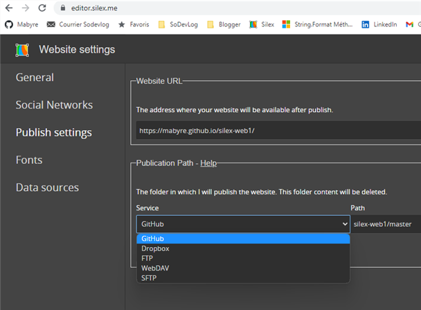

# Silex-web1

Is for create html  web site with **Silex**.

Make this repo **Github Pages** to publish with Silex.

[Silex-web1 site's url](https://mabyre.github.io/silex-web1/)

## Edit and publish with Github Pages

Into editor.silex.me it's possible to open your repo Github when grant access therefor you can edit and publish your web site.

But commit subject will always be "Batch update"

## Edit and publish into DropBox update site by Git Fork

There for I have my own Commit subject

## Change Site's Title by Settings

Look at the commit 

https://github.com/mabyre/silex-web1/commit/2189a96cca5c842189cb7fb82652dd3e302c9ea5

## Why Silex has no future

Just because it's takes Html has shit !

So tupid to create a html generator that make htmi unreadable !

Look at commit 

https://github.com/mabyre/silex-web1/commit/9bafca96777f8935cfc842efba92955ad2c950f4

Each time I add an element a section or a button html became unreadable WHY !!!!?

Is it redhibitory ... 

May be not, because Silex does not refactor all code, thanks to god !

But I was very scared.

That's All Folks

