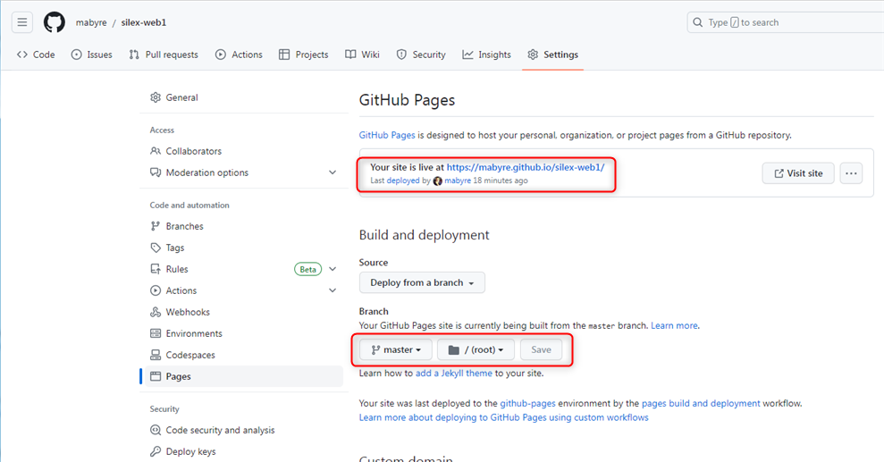

# Silex-web1

Is for create html  web site with **Silex**.

Make this repo **Github Pages** to publish with Silex.

[Silex-web1 site's url](https://mabyre.github.io/silex-web1/)

## Edit and publish with Github Pages

Into editor.silex.me it's possible to open your repo Github when grant access therefor you can edit and publish your web site.

But commit subject will always be "Batch update"

## Edit and publish into DropBox update site by Git Fork

There for I have my own Commit subject

That's All Folks.

